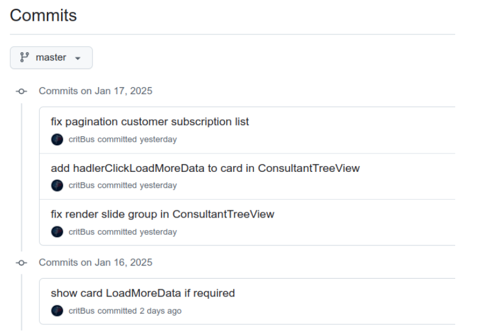
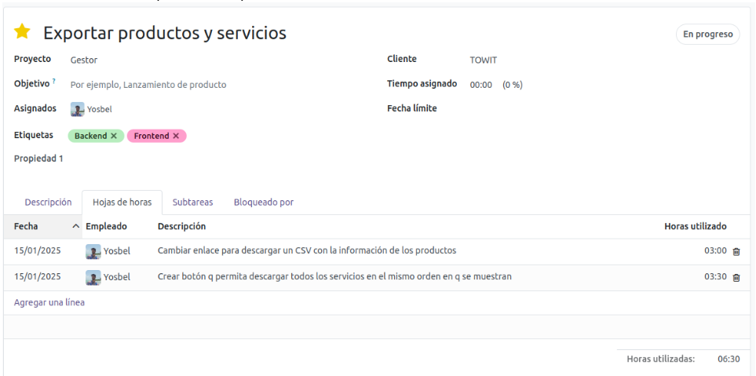
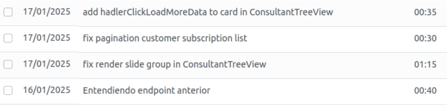
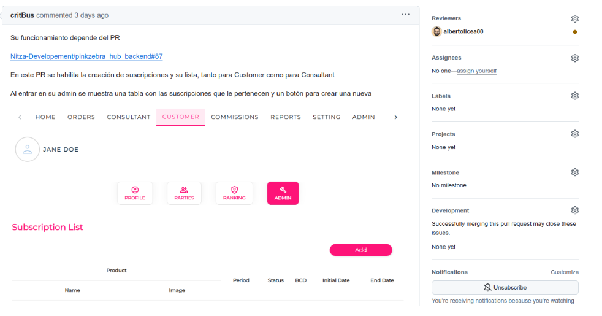

# **Guía de Bienvenida - Desarrollo de Software**
## **4- Flujo de Trabajo**

##### **4.1 Gestión de Tareas.**
*  Cada proyecto tiene un responsable designado
*  Las tareas son asignadas por el responsable del proyecto
*  El seguimiento se realiza a través de [Odoo](https://www.odoo.com/)

##### **4.1 Crear y Configurar la Rama.**
Utilizamos [Github Flow](https://docs.github.com/en/get-started/using-github/github-flow)

Asegurarse de estar en la rama principal actualizada:
```
git checkout main
git pull origin main
```

1. Crear una nueva rama para la tarea:

```
git checkout -b feature/nombre-descriptivo-tarea
```

##### **4.3 Desarrollo y Commits.**
1. Realizar cambios en el código
2. Preparar archivos modificados:

```
git add .
```
3. Crear commit con mensaje descriptivo:

```
git commit -m "descripción clara del cambio realizado"
```




4. Registrar el tiempo en Odoo:
    * Crear una entrada en el parte de tiempos

    


    * Detallar el trabajo realizado
    * Especificar el tiempo dedicado
    * Debemos hacer coincidir la descripción en los partes de  tiempo con los mensajes de los commits

    

##### **4.4 Gestión del Pull Request.**
**Caso A: Código Listo para Revisión**
1. Preparar archivos modificados:

```
git push origin feature/nombre-descriptivo-tarea
```

2. Crear Pull Request en la plataforma (GitHub/Azure):
    * Título descriptivo
    * Descripción detallada de los cambios
    * Solicitar revisores específicos
    * Agregar imágenes si hay modificaciones en el Frontend

    

**Caso B: Revisión Temprana**
1. Si se necesita feedback antes de completar la tarea:
    * Subir el trabajo en progreso
    * Crear PR marcado como "Draft" o "WIP" (Work In Progress)
    * Especificar en la descripción que es para revisión temprana
    * Detallar las partes que necesitan revisión


##### **4.5 Proceso de Revisión**
1. Atender los comentarios de la revisión
2. Para cada cambio solicitado:
    * Realizar las modificaciones necesarias
    * Crear nuevo commit
    * Registrar el tiempo en Odoo
    * Actualizar la rama remota:

```
git push origin feature/nombre-descriptivo-tarea
```

##### **4.6 Finalización**
1. Una vez aprobado el PR:
    * Asegurarse de que la rama está actualizada con main
    * Resolver conflictos si existen
    * Realizar merge siguiendo la política del  equipo
       

##### **4.7 Control de Calidad**
1. Una vez aprobado el PR:
    * Todo el código debe pasar por revisión antes de ser integrado
    * Los Pull Requests son revisados por desarrolladores designados
    * Utilizar los formateadores de código establecidos:
        * [Black](https://black.readthedocs.io/) para Python
        * [Prettier](https://prettier.io/) para código frontend


##### **4.8 Reuniones.**
* Dos reuniones semanales por [Google Meet](https://meet.google.com/)
* Participación en llamadas con clientes por [Teams](https://www.microsoft.com/es-es/microsoft-teams/group-chat-software) cuando sea necesario


## ← [Anterior capítulo](../Tech_Stack/WI.md) 


## → [Siguiente capítulo](../Best_Practices/WI.md)

