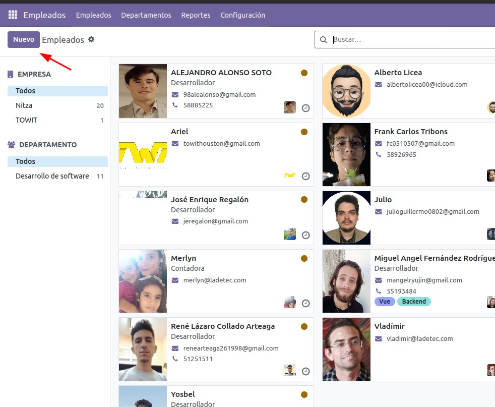
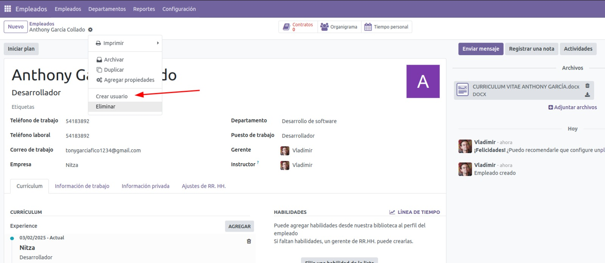
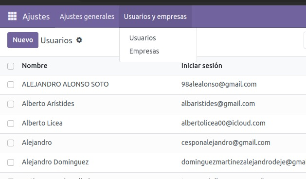
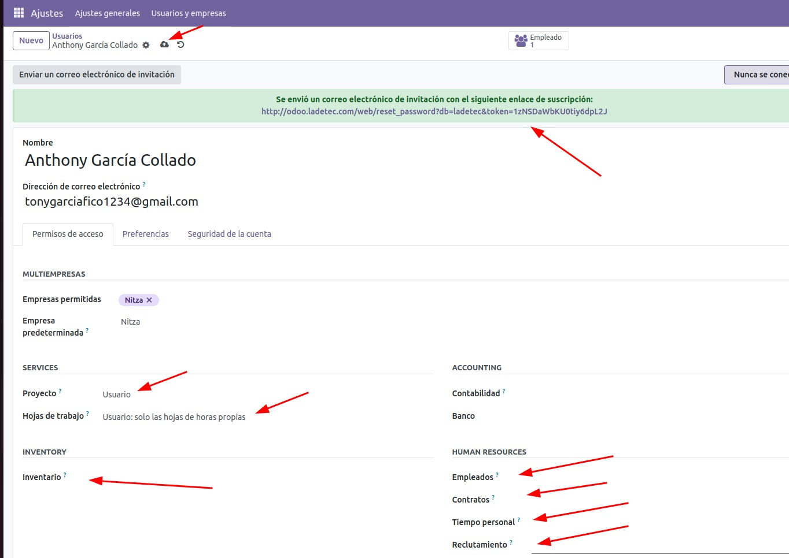
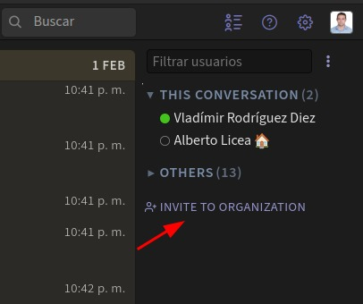
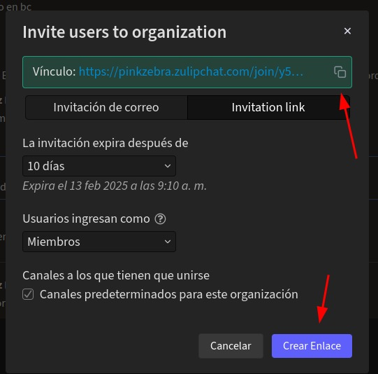
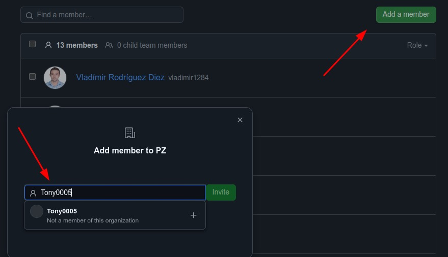
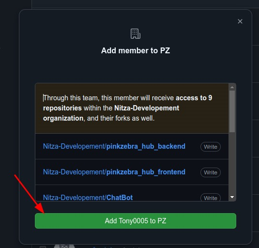

# **Creación de usuarios y acceso**
## **4- Crear usuarios**
1. Crear un nuevo empleado en el odoo
    * Ponerle foto de perfil tomada del CV o del user de whatsapp al empelado y al usuario

 

2. Crear el usuario a partir del empleado

3. Darle de alta en la lista de correos y usuarios de github

4. Revisar en ajuste de usuario

5. Ajustar los permisos del usuario en odoo y compartirle el enlace al nuevo empleado

6. Crear enlace de invitación al Zulip

7. Dar acceso a los repositorios de github

* Invitar

* Aceptar

